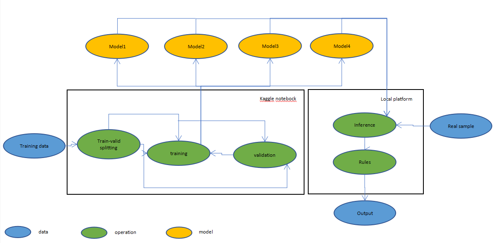
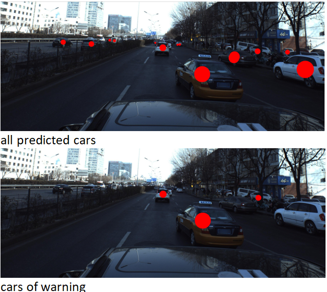

# IBM_ADD_code
  
 
See [Deep Learning-Based Car Collision Warning.docx](https://github.com/FishLikeApple/IBM_ADD_code/raw/master/Deep%20Learning-Based%20Car%20Collision%20Warning.docx) in this project.

# Environment
Linux or Windows, Python3, git, pip

# How To Use
git clone https://github.com/FishLikeApple/IBM_ADD_code  
git clone https://github.com/nianticlabs/monodepth2  
pip install -r IBM_ADD_code/requirements.txt  
python IBM_ADD_code/run_sample.py --input IBM_ADD_code/test_sample.jpg --output warning_image.jpg

%warning_image.jpg is the output image. You can also use another image as the input.%  
%If you want to use other images as input, the height and width of the input better be 1:4, and also you may need to change intrinsic parameters of the camera.%

# Acknowledgment Of Code
https://www.kaggle.com/hocop1/centernet-baseline  
https://www.kaggle.com/phoenix9032/center-resnet-starter
